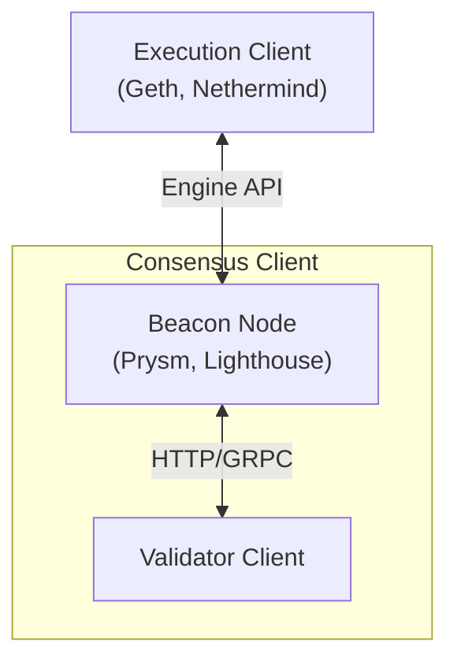

# Beacon Node

## 簡介 (Introduction)
Beacon Node (信標節點) 是 Ethereum 2.0 (現在稱為 Consensus Layer 或共識層) 的核心組件。它是負責維護 Beacon Chain (信標鏈) 的軟體客戶端。

在 Ethereum 轉向 Proof-of-Stake (PoS) 機制後，節點架構分為兩層：
1.  **Execution Layer (執行層):** 負責處理交易和智能合約 (由 Execution Client 如 Geth, Nethermind 運作)。
2.  **Consensus Layer (共識層):** 負責達成網路共識 (由 Beacon Node 和 Validator Client 運作)。

Beacon Node 屬於共識層客戶端的一部分。

## 主要功能 (Key Responsibilities)

Beacon Node 的主要職責是維護網路的狀態與共識：

1.  **P2P 網路通訊:** 與其他 Beacon Nodes 組成點對點 (P2P) 網路，傳播和同步區塊 (Blocks) 與證明 (Attestations)。
2.  **維護 Beacon Chain:** 下載並驗證所有的區塊，確保本地的 Beacon Chain 數據與網路一致。它保存了關於 Validators (驗證者) 的所有資訊（如餘額、狀態、表現）。
3.  **協調 Validators:** 為 Validator Client 提供必要的資訊，告訴它們何時該生產區塊或何時該對區塊進行投票 (Attest)。
4.  **與 Execution Layer 溝通:** 通過 Engine API 與 Execution Client 連接。Beacon Node 會請求 Execution Client 驗證交易的有效性，並接收 Execution Client 產生的執行負載 (Execution Payload) 來打包進新的區塊中。

## 架構關係 (Architecture)

一個完整的 Ethereum 節點通常包含三個部分：

*   **Beacon Node vs. Validator Client:**
    *   **Beacon Node:** 是網路的「地圖」和「通訊中心」。它不直接持有私鑰，也不進行簽名。它負責「讀取」網路狀態。
    *   **Validator Client:** 是「操作員」。它持有私鑰，負責簽名區塊和證明。它必須連接到 Beacon Node 才能知道該簽署什麼。
    *   通常一個 Beacon Node 可以服務多個 Validator Clients。

## 常見的 Beacon Node 實作 (Implementations)

*   **Prysm** (Go)
*   **Lighthouse** (Rust)
*   **Teku** (Java)
*   **Nimbus** (Nim)
*   **Lodestar** (TypeScript)

## 為什麼重要？

沒有 Beacon Node，Validator 就無法知道網路的當前狀態，也就無法履行職責（提議區塊或驗證）。它是 PoS 共識機制的骨幹，確保了網路的活性 (Liveness) 和安全性 (Security)。

## 常見誤解：Geth 裡的 "Beacon" 是什麼？

Go-Ethereum (Geth) 是一個 **Execution Client**，它本身**不是**一個完整的 Beacon Node。但在 Geth 的代碼或文檔中常會看到 "beacon" 字眼，通常指以下幾種情況：

1.  **Engine API 整合:** Geth 需要透過 Engine API 聽從 Beacon Node (Consensus Layer) 的指揮。Geth 內部的 "beacon" 邏輯常指處理這些來自 CL 指令的模組。
2.  **Light Client (輕客戶端):** Geth 包含如 `blsync` 等功能，讓它可以作為 Beacon Light Client 運作，自行追蹤 Beacon Chain 的頭部以加速同步，但它不能參與共識驗證。
3.  **開發模擬:** Geth 可能包含模擬 Beacon Node 的功能，用於單機開發測試。

**總結：** 要運行完整的 Ethereum 節點，必須同時運行 **Geth (EL)** 和 **真正的 Beacon Node (CL, 如 Prysm/Lighthouse)**。
