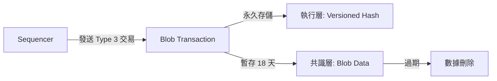

# Blob 交易生命週期 (Blob Transaction Lifecycle)

本文詳細描述了 [[eip-4844]] 中引入的 Blob 交易（[[eip-2718|Type 3 Transaction]]）從產生到過期的完整過程。

## 1. 創建與提交 (Creation & Submission)
這個階段通常由 Layer 2 (Rollup) 的 **Sequencer** 發起。

1.  **批次壓縮:** Sequencer 收集 L2 用戶的交易，將其壓縮成批次數據 (Batch)。
2.  **構建 Blob:** 這些數據被格式化為一個或多個 **Blobs**（每個 Blob 最多 128 KB）。
3.  **生成承諾:** 對每個 Blob 計算 **KZG 承諾 (KZG Commitment)**。這個承諾就像是數據的數位指紋。
4.  **發送交易:** Sequencer 向 Ethereum L1 廣播一筆 **Type 3 交易 (Blob Transaction)**。
    *   **交易主體 (Execution Payload):** 包含 KZG 承諾、版本化哈希 (Versioned Hash) 和執行層邏輯。
    *   **Sidecar (Consensus Payload):** 包含實際的 Blob 數據和 KZG 證明。

## 2. 傳播與驗證 (Propagation & Verification)
交易進入 Ethereum 網路後，執行層 (EL) 和共識層 (CL) 協同工作。

1.  **Mempool 傳播:** Type 3 交易在執行層節點的 Mempool 中傳播。節點會檢查交易的基本有效性（如簽名、Nonce、Gas 費）。
2.  **Sidecar 分離:** 實際的 Blob 數據（Sidecar）不會進入執行層區塊的主體，而是通過共識層的 P2P 網路（Gossipsub）獨立傳播。
3.  **區塊提議:** 當一個驗證者（Proposer）被選中提議新區塊時，它會將 Type 3 交易打包進區塊，並確保相應的 Blob Sidecar 已在共識層廣播。
4.  **節點驗證:** 其他驗證者收到區塊時，會執行以下檢查：
    *   **數據可用性:** 確認是否已收到 Blob Sidecar 數據。
    *   **KZG 驗證:** 驗證 Blob 數據是否與交易中的 KZG 承諾相符。

## 3. 存儲與確認 (Storage & Confirmation)

1.  **執行層 (L1):** 區塊被確認。EVM 執行交易，但 **EVM 無法讀取 Blob 的內容**。它只能訪問 Blob 的版本化哈希（通過 `BLOBHASH` opcode）。這確保了執行層狀態不會因為 Blob 數據而膨脹。
2.  **共識層 (Beacon Node):** 信標鏈節點 (Beacon Nodes) 存儲完整的 Blob Sidecar 數據。

## 4. 過期與修剪 (Expiry & Pruning)

1.  **存儲窗口:** Blob 數據在共識層節點上僅保存約 **18 天** (4096 Epochs)。
2.  **修剪 (Pruning):** 一旦超過這個時間窗口，共識層節點可以自由刪除（修剪）這些 Blob 數據。
3.  **永久留存:** 雖然 Blob 數據本身被刪除了，但在執行層區塊中記錄的 **KZG 承諾** 和 **版本化哈希** 是永久存在的。這保證了歷史記錄的完整性——即使數據不在了，我們仍知道數據的「指紋」是什麼。

## 流程簡圖

