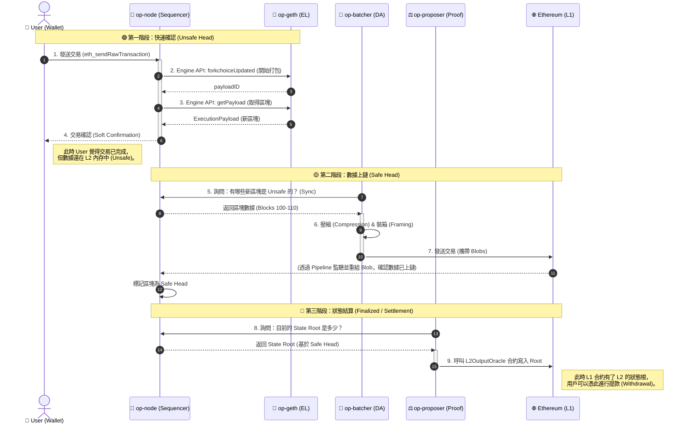

# OP Stack 核心架構：四大模組協同運作流程

**日期:** 2026-02-04
**主題:** Optimism Layer 2 組件交互、數據流向
**關鍵模組:** `op-node`, `op-geth`, `op-batcher`, `op-proposer`

---

## 1. 系統架構全景圖 (Mermaid)

這張圖展示了從「使用者發送交易」到「數據上鏈」與「狀態提交」的完整生命週期。

---

## 2. 四大模組職責詳解

要運行一條完整的 L2 鏈（具備出塊、數據可用性、提款功能），必須同時運行以下四個服務：

| 模組名稱 | 角色定位 | 核心職責 (One-liner) | 交互對象 | 如果掛了會怎樣？ |
| :--- | :--- | :--- | :--- | :--- |
| **`op-node`** | **大腦 / 廠長** | 負責 P2P 通訊、驅動區塊構建 (Sequencing)、以及透過 Pipeline 讀取 L1 數據。 | User, op-geth, L1 | 整個鏈停止出塊，無法同步。 |
| **`op-geth`** | **肌肉 / 機器** | 負責執行 EVM 交易、維護世界狀態 (StateDB)、產生區塊收據。它是唯一有狀態的地方。 | op-node | 沒地方跑智能合約，鏈形同虛設。 |
| **`op-batcher`** | **快遞員 / 搬運工** | 負責將 L2 的交易數據 (Unsafe Blocks) 壓縮並上傳到 L1 (Blobs)，確保**數據可用性 (DA)**。 | op-node, L1 | 鏈可以跑，但數據沒上鏈 (不安全)，其他節點無法同步。 |
| **`op-proposer`** | **會計師 / 稽核** | 負責定期將 L2 的 **狀態根 (State Root)** 提交到 L1 合約，作為提款的依據。 | op-node, L1 | 鏈正常運作，但用戶**無法提款**回 L1。 |

---

## 3. 關鍵數據流 (Data Flow)

這三個流程分別對應了區塊的三種狀態：

1.  **Sequencing (快速路徑) -> `Unsafe Block`**
    * **觸發者:** User 發起交易。
    * **動作:** `op-node` 收到交易 -> 指揮 `op-geth` 出塊 -> 產生 Unsafe Block。
    * **特點:** 延遲極低 (毫秒級)，但依賴 Sequencer 信任。

2.  **Batching (安全路徑) -> `Safe Block`**
    * **觸發者:** `op-batcher` 定時任務。
    * **動作:** `op-batcher` 從 `op-node` 抓取 Unsafe Block -> 壓縮 -> 發送到 L1 Blob。
    * **驗證:** `op-node` 透過 Derivation Pipeline 從 L1 讀回這些 Blob 並驗證無誤後，將區塊標記為 Safe。
    * **特點:** 即使 Sequencer 跑路，數據也能從 L1 還原。

3.  **Proposing (結算路徑) -> `Finalized State`**
    * **觸發者:** `op-proposer` 定時任務。
    * **動作:** `op-proposer` 讀取經過確認的 State Root -> 寫入 L1 智能合約 (`L2OutputOracle`)。
    * **特點:** 這是資產跨鏈 (Bridge) 的基礎，只有 Proposer 提交了 Root，L1 上的合約才知道你在 L2 賺了錢。

---

## 4. 常見觀念修正

* **誤區:** 一般人可以監聽 L2 Mempool。
    * **真相:** 目前 Sequencer 是私有的，交易透過 HTTP 直接送達，**不走 P2P 廣播**，所以無法監聽 Pending Txs (Private Mempool)。
* **誤區:** `op-geth` 自己會去 L1 下載 Blob。
    * **真相:** `op-geth` 是一個純粹的執行引擎，看不到 Blob。是 `op-node` 負責同時連接 L1 EL (Geth) 和 L1 CL (Beacon)，把 Blob 抓下來處理後，再餵給 `op-geth`。
* **誤區:** L2 區塊一定要等 L1 確認才能產生。
    * **真相:** L2 是「樂觀執行」的。Sequencer 會**先斬後奏**產生 Unsafe Block 給用戶，之後再補票 (Batching) 上傳 L1。